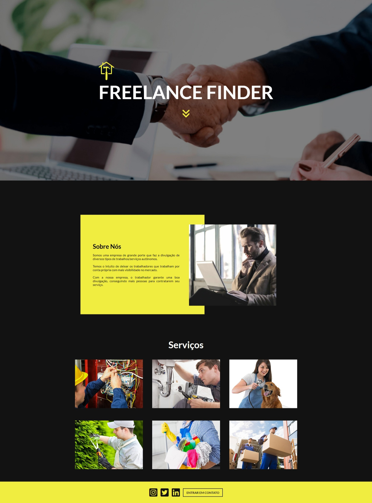

# 👨🏻‍💼 FREELANCE FINDER

Uma empresa que oferece divulgação dos serviços das pessoas que trabalham por conta própria.

## 📃 Página inicial do site

  

## 🛠 Tecnologias

HTML, CSS e JavaScript

## Bibliotecas utilizadas

 - [Font Awesome](https://fontawesome.com/)
 - [Swiper](https://swiperjs.com/)

## Funcionalidades / diferencial

 - Desktop
 - Mobile

## Aprendizados

Aprendi a colocar as boas práticas do HTML e CSS, colocando no projeto o HTML semântico e responsividade com CSS.

## Feedback

Se você tiver algum feedback, por favor nos deixe saber por meio de vinnicorrea7@gmail.com.

## 🔗 Links

